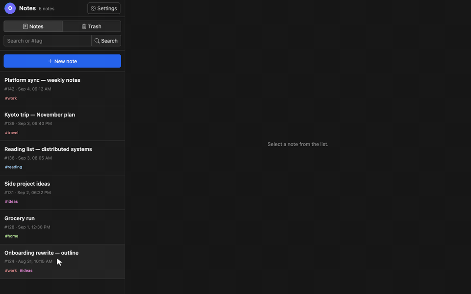

# Ginote

## 앱 소개

Ginote는 GitHub의 Issues(이슈)를 개인 노트처럼 쓰는 간단하고 안전한 웹 앱입니다.
노트는 별도 앱 서버나 데이터베이스가 아니라, 사용자가 고른 GitHub 저장소에
저장됩니다. 앱을 연 뒤에는 브라우저가 GitHub와 직접 통신합니다.

**서비스 주소(누구나 바로 사용 가능):**

[https://note.gitools.net](https://note.gitools.net)

## 주요 특징

- **비공개 저장소에 직접 저장:** 별도 앱 서버나 데이터베이스 없이, 비공개(Private)
  저장소의 이슈를 노트로 사용합니다.
- **브라우저에서 직접 연결:** 브라우저가 GitHub API를 직접 호출합니다. 앱 운영
  서버가 노트나 PAT를 받아 보관하는 중간 단계가 없습니다.
- **태그·검색·휴지통:** GitHub 라벨을 태그로 사용하며 본문 검색과 닫힌 이슈 기반
  휴지통을 지원합니다.
- **키보드를 통한 제어:** 노트 목록 이동·열기·선택, 새 노트 작성, 저장소 전환
  등을 키보드로 할 수 있습니다.
- **파일과 이미지 첨부:** 첨부파일을 같은 저장소에 보관하고 앱과 GitHub 양쪽에서
  확인할 수 있습니다. 자세한 내용은 [첨부파일 저장 방식](docs/ATTACHMENTS.md)을
  참고하세요.
- **본문 추가 암호화:** 비공개 저장소에 저장하는 것만으로 부족하다면 본문을
  브라우저에서 AES-GCM 방식으로 한 번 더 암호화할 수 있습니다. 자세한 내용은
  [암호화 방식](docs/ENCRYPTION.md)을 참고하세요.
- **웹과 데스크톱 지원:** 설치 가능한 PWA와 Tauri 기반 macOS·Windows·Linux 앱을
  제공합니다. 데스크톱 앱의 패키징과 릴리스는 [데스크톱 앱 문서](docs/DESKTOP.md)를
  참고하세요.

## 사용 안내

### 내 데이터는 어디로 가나요?

**Ginote는 파일로 제공되는 정적 웹 앱입니다.** 배포 서버는 HTML, CSS,
JavaScript 같은 앱 파일만 전달합니다. 로그인이나 노트 저장을 처리하는 별도
앱 백엔드는 없으며, 앱을 연 뒤의 데이터 통신은 사용자의 브라우저와 GitHub API
사이에서 직접 이루어집니다.

```text
사용자 브라우저  ←──── 직접 통신 ────→  GitHub
     │
     └─ PAT·앱 설정·저장 전 초안은 이 브라우저에만 보관
```

- 노트와 태그, 첨부파일은 사용자가 지정한 GitHub 저장소에만 저장됩니다.
- PAT와 앱 설정은 사용자의 브라우저에만 보관되며, 인증할 때만 GitHub API로
  전달됩니다.
- 저장 전 초안은 해당 브라우저 안에만 남습니다.
- 원하면 노트 본문을 브라우저에서 AES-GCM으로 암호화한 뒤 전송할 수 있습니다.
  잠금 숫자는 브라우저 밖으로 나가지 않고, GitHub에는 복호화된 본문이 아닌
  암호문만 저장됩니다.
- 앱 운영자에게 노트, PAT, 설정을 보내는 API가 없으며 분석·추적 서비스도
  사용하지 않습니다.

즉, 앱 파일을 내려받는 요청 외에는 사용자의 추가 데이터가 GitHub 이외의 앱
운영자나 다른 서버로 전송되지 않습니다. 실제 노트 데이터가 존재하는 곳은
**본인의 브라우저와 본인이 선택한 GitHub 저장소뿐**입니다.

### 화면



미리보기 GIF를 다시 만드는 방법은 [docs/screencasting.md](docs/screencasting.md)에
정리했습니다.

### 키보드 단축키

노트 목록에서 다음 단축키를 사용할 수 있습니다. 입력창에 글을 쓰는 동안에는
목록 단축키가 동작하지 않습니다. `Ctrl/Cmd + R`은 브라우저의 새로고침 단축키라
어디서든 앱을 다시 불러옵니다.

| 키 | 동작 |
| --- | --- |
| `↑` / `↓` | 노트 목록에서 이동 |
| `Enter` | 현재 노트 열기 · 한 번 더 누르면 편집 |
| `N` | 새 노트 만들기 |
| `` ` `` | 저장소 선택창 열기 |
| `1`–`9` | 등록된 순서대로 저장소 전환 |
| `Esc` | 선택 해제 · 삭제 취소 · 안내 닫기 |
| `Space` | 현재 노트 선택 |
| `Shift` + `↑` / `↓` | 여러 노트 범위 선택 |
| `Delete` / `Backspace` | 선택한 노트를 휴지통으로 이동 |
| `Ctrl/Cmd + R` | 앱 새로고침 |

노트를 열고 입력창에 포커스가 없을 때는 다음 단축키도 사용할 수 있습니다.

| 키 | 동작 |
| --- | --- |
| `T` | 태그 추가 |
| `A` | 파일 첨부 |
| `P` | 상단고정 전환 |
| `L` | 잠금·잠금 해제 |
| `Delete` | 노트를 휴지통으로 이동 |
| `G` | GitHub 이슈 보기 |
| `M` | MD뷰어 열기·닫기 |
| `R` | 앱 전체 새로고침 |
| `S` | 현재 노트 저장 |

### PWA(설치형 웹 앱)

프로덕션 빌드는 브라우저에서 설치해 앱처럼 사용할 수 있는 PWA로 동작합니다.
브라우저에서 서비스 주소를 연 뒤 브라우저의 설치 메뉴를 사용하면 됩니다.
매니페스트와 서비스 워커는 특정 도메인이나 호스팅 서비스에 종속되지 않으며,
앱이 배포된 경로를 기준으로 동작합니다. 서비스 워커(브라우저가 앱 파일을
잠시 보관하는 기능)는 앱과 같은 출처의 파일만 캐시하고 GitHub API 요청, PAT,
노트 데이터는 캐시하지 않습니다.

### 데스크톱 앱 다운로드

macOS·Windows·Linux용 설치 파일은 [GitHub Releases](https://github.com/zidell/ginote/releases)에서
내려받을 수 있습니다. 데스크톱 앱도 별도 앱 서버 없이 GitHub API에 직접
연결합니다.

macOS Homebrew 설치, 로컬 실행, 플랫폼별 패키징과 릴리스 절차는
[데스크톱 앱 문서](docs/DESKTOP.md)에 정리했습니다.

## 운영·개발 안내

### 시작하기

```bash
npm install
npm run dev
```

잠금 기능은 공개 기본값으로도 동작하지만, 이 프로젝트를 포크해 직접 운영하거나
배포한다면 첫 잠금 노트를 만들기 전에 배포 전용 pepper를 설정해야 합니다. 암호화
동작과 `VITE_NOTE_LOCK_PEPPER` 설정 방법은 [암호화 방식](docs/ENCRYPTION.md)을
참고하세요.

GitHub에서 fine-grained personal access token(PAT)을 만들고 다음 권한만 부여하세요.

- Repository access: 노트 저장소 하나
- Issues: Read and write (읽기 및 쓰기)
- Metadata: Read (읽기)
- Contents: Read and write (읽기 및 쓰기, 파일·클립보드 이미지 첨부를 사용할 때만)

PAT와 저장소 설정은 사용자의 브라우저에만 저장되며, API 요청은 브라우저에서
`api.github.com`으로 직접 전송됩니다. PAT를 저장하도록 선택하면 브라우저의
`localStorage`에 암호화하지 않은 상태로 보관됩니다. 같은 웹 주소에서 실행되는
스크립트는 이 값에 접근할 수 있으므로 개인 기기에서만 사용하고, 권한 범위를
저장소 하나로 제한한 fine-grained PAT를 사용하세요.

### 첨부파일 저장 방식

첨부파일은 같은 GitHub 저장소의 `.issue-note-assets/issues/{이슈 번호}/` 폴더에
파일로 저장하고, 이슈 본문에는 Markdown 링크로 연결합니다. 앱과 GitHub 이슈
페이지에서 모두 확인할 수 있습니다. 저장 경로, 첨부 동작, 기존 노트와의
호환성 규약은 [첨부파일 저장 방식](docs/ATTACHMENTS.md)을 참고하세요.

### 편집 및 저장

편집 내용은 1초 간격으로 브라우저의 저장 전 초안에 보관되고, 마지막 입력 후
5초가 지나면 GitHub Issue에 자동 저장됩니다. 자동 저장까지 기다리는 시간은
환경설정에서 3~30초로 바꿀 수 있습니다. 기본 설정에서는 본문의 첫 줄에서
앞뒤 공백을 뺀 뒤 앞 50자를 이슈 제목으로 사용합니다. 환경설정에서 제목을
따로 입력할지, 글꼴·글자 크기·줄간격을 어떻게 표시할지도 바꿀 수 있습니다.

### 노트 잠금

일반 노트의 본문은 6자리 숫자로 브라우저에서 선택적으로 암호화할 수 있습니다.
GitHub에는 암호문만 저장되며 제목·태그·첨부파일은 암호화하지 않습니다. 잠금
세션, 키 파생, AES-GCM 형식과 배포 설정은 [암호화 방식](docs/ENCRYPTION.md)을
참고하세요.

GitHub 라벨은 별도 접두어 없이 노트의 태그로 사용합니다. 편집기에서 태그를
추가하거나 제거할 수 있고, 태그 메뉴에서 기존 태그를 검색하거나 새 태그를 만들
수 있습니다. 목록에서 태그를 누르면 그 태그가 붙은 노트만 볼 수 있습니다. 앱은
태그 이름을 바탕으로 표시색을 정하므로 같은 이름에는 항상 같은 색을 사용합니다.
이 표시색은 GitHub에 저장된 색상과는 별개입니다. 새 태그를 만들 때만 계산한
색상을 GitHub에 저장하고, 기존 태그 이름을 바꿀 때는 이슈와 색상을 유지한 채
이름만 바꿉니다.

목록은 최근에 수정된 순서로 30개씩 불러오며, 아래의 **더 보기** 버튼으로 다음
페이지를 이어서 불러옵니다. 현재 목록은 한 시간마다 화면 뒤에서 다시 확인해 새
이슈를 반영합니다. 노트를 선택하면 현재 목록의 내용부터 바로 보여주고, 그 이슈
하나만 다시 확인합니다. 아직 저장하지 않은 편집 내용이 있거나 다시 확인하는
동안 입력을 시작하면 GitHub에서 늦게 온 응답으로 본문을 덮어쓰지 않습니다.

별도 제목을 사용하지 않을 때 목록 미리보기는 본문의 첫 줄에서 링크·굵게 표시
같은 Markdown 문법을 제거한 뒤 최대 50자까지만 보여줍니다. 편집기에서 커서가
Markdown 링크 또는 일반 HTTP(S) 주소 위에 있으면 짧은 링크가 나타나며, 누르면
새 탭이나 데스크톱 기본 브라우저에서 엽니다.

GitHub API는 이슈 자체를 영구 삭제할 수 없으므로, 앱에서는 이슈를 닫아
휴지통으로 보냅니다. 휴지통에는 닫은 지 30일 이내인 노트만 표시되며, 30일이
지난 이슈의 본문과 제목은 저장소에 남습니다. 첨부파일의 보관 기간과 자동 정리
동작은 [첨부파일 저장 방식](docs/ATTACHMENTS.md)을 참고하세요.

### 데스크톱 앱 빌드 및 릴리스

Tauri 2로 프로덕션 `dist/`를 macOS·Windows·Linux용 실행 파일로 패키징합니다.
로컬 실행, 플랫폼별 빌드, GitHub Releases 서명·공증, Homebrew 배포 유지보수는
[데스크톱 앱 문서](docs/DESKTOP.md)를 참고하세요.

### 빌드

```bash
npm run build
```

`dist/` 폴더를 GitHub Pages나 다른 정적 호스팅에 배포할 수 있습니다.

### 테스트

```bash
npm test
```

개발 중에 테스트를 계속 실행하려면 `npm run test:watch`, Svelte 정적
검사는 `npm run check`를 사용합니다. `main` 푸시와 pull request에서는 GitHub
Actions가 정적 검사, 테스트, 빌드를 자동으로 실행합니다.

### 개발 및 유지보수

이 저장소는 별도의 `AGENTS.md`를 운영하지 않습니다. 구현을 변경할 때 필요한
프로젝트 규약과 데이터 호환성 정보는 이 README와 `docs/`의 관련 문서를 기준으로
합니다.

#### 개발 환경과 명령어

CI는 Node.js 22와 `npm ci`를 사용합니다. 의존성을 바꿀 때는 `package.json`과
`package-lock.json`을 함께 커밋하세요.

```bash
npm ci              # 잠금 파일 기준 설치
npm run dev         # 개발 서버
npm run check       # Svelte 정적 검사
npm test            # Vitest 전체 테스트
npm run test:watch  # 변경 감지 테스트
npm run build       # dist/ 프로덕션 빌드
npm run preview     # 빌드 결과 확인
```

변경을 마치기 전에는 최소한 다음 명령을 모두 통과시켜야 합니다.

```bash
npm run check
npm test
npm run build
```

`main` 브랜치 푸시와 pull request에서도 같은 검사를 GitHub Actions가 수행합니다.
PAT, 개인 저장소 이름, 개인 배포 설정과 실제 노트 데이터는 커밋하지 마세요.

#### GitHub 데이터 모델과 API 규약

- 이슈 한 개가 노트 한 개입니다. 이슈 본문은 노트 본문, 이슈 제목은 별도 제목
  또는 본문 첫 줄의 앞 50자, 이슈 라벨은 태그입니다.
- 열린 이슈는 일반 목록, 닫힌 이슈는 휴지통입니다. 앱에서 이슈를 영구 삭제하지
  않습니다.
- 일반 목록은 저장소 Issues API, 본문 검색과 휴지통은 Search API를 사용합니다.
  휴지통 쿼리의 `closed:>=YYYY-MM-DD` 30일 조건을 제거하지 마세요.
- 목록 머리의 숫자는 현재 내려받은 페이지 수가 아니라 조건에 맞는 전체 이슈
  수입니다. 저장소 Issues API에는 전체 개수가 없어 첫 페이지를 읽을 때 Search
  API의 `total_count`도 함께 확인합니다.
- 페이지 크기의 기본값은 `src/lib/github.js`의 `DEFAULT_ISSUE_PAGE_SIZE`이며,
  사용자는 환경설정에서 10~100개 범위로 바꿀 수 있습니다. 저장소 Issues API는
  `Link` 헤더, Search API는 `total_count`로 다음 페이지를 판단합니다. pull
  request는 노트 목록에서 제외합니다.
- Search API 결과는 최대 1,000개까지만 페이지를 제공하므로 다음 페이지 계산도
  이 한도를 넘기지 않습니다.
- 검색어, 상태, 선택 태그가 바뀐 뒤 늦게 도착한 응답은 현재 목록에 섞지 않습니다.
  비동기 목록 코드를 바꿀 때 이 요청 조건 검사를 유지하세요.
- 새 노트는 편집 화면을 먼저 열고 이슈 생성 요청으로 번호를 백그라운드에서
  확보합니다. 생성 직후 GitHub 검색 색인에 아직 잡히지 않더라도 로컬 목록에서
  사라지지 않게 저장 결과를 직접 합칩니다.
- API 버전과 공통 인증 헤더는 `src/lib/github.js`의 `request()`에서 통제합니다.
  오류 객체의 HTTP 상태와 rate-limit 헤더는 사용자용 오류 안내에 사용되므로
  보존해야 합니다.
- 목록 선택 시 이슈 하나를 백그라운드 갱신하되, dirty 상태이거나 요청을 기다리는
  동안 revision이 바뀌면 응답을 적용하지 않습니다. 이 보호 조건 없이 원격
  갱신을 에디터 값에 직접 대입하지 마세요.

#### UI 언어

UI 번역은 `svelte-i18n`, `src/lib/i18n.js`, `src/lib/locales/`의 메시지 카탈로그를 사용합니다.
영어를 fallback으로 하며 한국어, 중국어(간체), 일본어, 독일어, 프랑스어,
이탈리아어를 지원합니다. 기본값은 브라우저 언어 자동 감지이고 환경설정에서
직접 바꿀 수 있습니다. 버튼, 설명, 오류, 확인창, placeholder, `aria-label`을
추가할 때 반드시 메시지 키와 번역 카탈로그를 함께 갱신하세요.

#### 라우팅과 반응형 UI

`spa-stack-router`의 hashbang 스택 라우팅을 사용합니다. 목록 위에 노트, 새 노트,
태그, 환경설정 화면을 스택으로 쌓기 때문에 브라우저 뒤로 가기와 `Esc`가 이전
목록 상태로 자연스럽게 돌아갑니다. 화면을 열 때 기존 스택을 불필요하게 통째로
교체하지 마세요.

반응형 경계는 Bootstrap의 `lg` 직전인 `991.98px`입니다. 이보다 좁을 때 목록과
본문은 슬라이드 화면으로 전환되고 본문 툴바 작업은 **더보기** 드롭다운에
들어갑니다. 데스크톱 전용·모바일 전용 컨트롤을 바꿀 때 두 폭을 모두 확인하세요.
목록 행 전체가 노트 열기 클릭 영역이며, 행 안의 태그 버튼만 태그 필터 동작을
우선합니다.

모바일 목록과 본문 사이는 브라우저의 same-document View Transitions API를 사용할
수 있을 때 `ease-out` 슬라이드로 전환합니다. 목록은 움직이지 않고 본문만 오른쪽에서
한 겹 쌓이거나 빠집니다. 라우터 스택을 구독해 방향을 정하므로 본문 진입뿐 아니라
브라우저 뒤로가기와 `Esc`에도 역방향 전환이 적용됩니다. API를 지원하지 않는
환경에서는 기존 라우팅 동작을 유지합니다.

#### 첨부파일 호환성 규약

첨부파일 경로와 본문 링크 형식은 이미 만들어진 노트를 다시 읽는 데이터
프로토콜입니다. 형식과 변경 시 지켜야 할 조건은 [첨부파일 저장 방식](docs/ATTACHMENTS.md)의
호환성 규약을 기준으로 검토하세요.

#### 변경 시 테스트 위치

- 제목 생성·Markdown 미리보기: `src/lib/notes.test.js`
- 브라우저 언어 선택: `src/lib/i18n.test.js`
- 태그 이름 기반 색상: `src/lib/colors.test.js`
- 첨부 링크 포맷과 파싱: `src/lib/attachments.test.js`
- 요청 URL, 본문, 페이지 처리, 오류·첨부 API: `src/lib/github.test.js`

UI 변경은 자동 테스트와 별도로 데스크톱 폭과 992px 미만 모바일 폭에서 확인해야
합니다. 특히 사이드바 스크롤, 숨김·노출되는 검색 도구, 스택 뒤로 가기, 모바일
본문 툴바, API 응답 전 로딩 표시를 함께 점검하세요.

## 기능 요청

기능 요청사항이 있는 경우 포크해서 직접 변경하세요. 제가 쓰기에는 이미 충분해서
별도의 기능 제안은 받지 않습니다.

## 라이선스

[MIT License](LICENSE)
